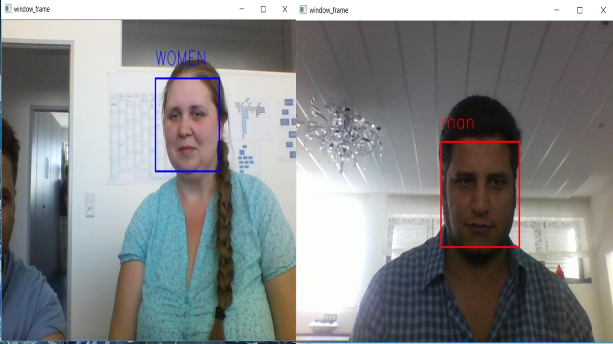

### In this project, I use a deep learning-based approach to improve gender classification detection. My final model uses a fully convolutional neural network to output an image of a Man or woman. gender classification and detection using: IMDB datasets with a keras CNN model and openCV.
* IMDB gender classification test accuracy: 96%.

# gender examples:

[alt tag](image/test7.png) 

  

## Instructions

### Run real-time emotion demo:
> python3 video_emotion_color_demo.py

### Run real-time guided back-prop demo:
> python3 image_gradcam_demo.py

### Make inference on single images:
> python3 image_emotion_gender_demo.py <image_path>

e.g.

> python3 image_emotion_gender_demo.py ../images/test_image.jpg.

### to watch Face and gender classification .
*Run the video_Gender.py file
>.

## Software Requirements.
* Python 3.5 or 3.6
* TensorFlow
* keras
* OpenCV 
* h5py
* pandas
* scipy.### To train models for gender classification:

* Download the imdb_crop.tar file from [here](https://data.vision.ee.ethz.ch/cvl/rrothe/imdb-wiki/) (It's the 7GB button with the tittle Download faces only).

* Move the downloaded file to the datasets directory inside this repository.

* Untar the file:
> tar -xfv imdb_crop.tar

*Run the train_gender face.py file
>  train_gender_classifier.py

.

